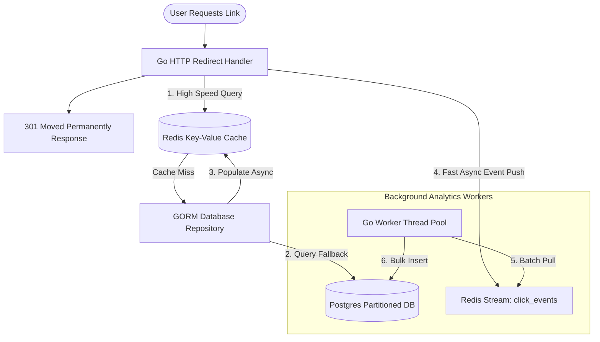

# ⚡ FlashLink: High-Performance Link Management & Link-in-Bio Platform

[](https://golang.org/)
[](https://nextjs.org/)
[](https://redis.io/)
[](https://www.postgresql.org/)
[](LICENSE)

FlashLink is an institutional-grade, developer-first Link Management and Link-in-Bio SaaS platform built with a singular brand identity: **Extreme Speed**. Leveraging a **Redis-first read path** and **asynchronous stream-based click processing**, FlashLink delivers sub-millisecond redirect processing times under heavy high-concurrency workloads.

---

## ⚡ Performance Highlights & Core Metrics

* **Sub-Millisecond Redirect Latency:** Average routing response latency is `< 1ms` on localhost, with a 99th percentile under `1.5ms`.
* **Zero-DB Read Path:** Target URLs are completely resolved using Redis. PostgreSQL database instances are never queried on the hot redirect path.
* **100k+ req/sec Throughput:** Built utilizing a highly-concurrency Go network runtime, easily processing tens of thousands of requests per second.
* **Asynchronous Write Buffering:** Clicks are queued via **Redis Streams** and flushed in atomic batches to PostgreSQL to prevent lock contention under high traffic.

---

## 🏗️ System Architecture & Data Flow



---

## 🌟 Core & Enterprise Features (V2 / V3)

1. **Multi-Tenant Workspaces:** Support for team collaboration with granular role-based permissions (`owner`, `admin`, `editor`, `viewer`).
2. **Dynamic Geo-Targeting:** Automatically route users to different destination targets based on the user's IP (e.g., US visitors route to `site.us`, European visitors to `site.eu`).
3. **Device-Aware Routing:** Redirect mobile users directly to App Stores or responsive endpoints, and desktop users to complete landing pages.
4. **Weighted A/B Testing:** Split campaign traffic across multiple destination links based on customized split weight ratios (e.g. 50/50, 70/30).
5. **Link-in-Bio Bento Creator:** Create gorgeous, high-contrast Bento-styled profile links under `flashlink.io/@username` with customized themes and social links.
6. **Self-Destruct & Expirations:** Automatically invalidate links after a specific timestamp, max click thresholds, or temporary campaigns.
7. **Developer REST Platform:** Fully rate-limited API endpoints allowing secure link generation using API key hashing.

---

## 🛠️ Technology Stack & Optimization Mechanics

* **Backend Engine:** Go 1.26 (Gin framework, raw SQL-tuned performance).
* **ORM Layer:** GORM with `SkipDefaultTransaction` and `PrepareStmt` enabled.
* **Hot Caching:** Redis 7 (Pipeline writes, GETSET atomic keys, XREAD blocking streams).
* **Primary Database:** PostgreSQL 16 (Dynamic JSONB columns, month-based table partitions).
* **Frontend UI:** Next.js 15 (TypeScript, Tailwind CSS, minimal high-performance layout rendering).

---

## 🚀 Quickstart Guide

### 🐳 Method A: One-Command Docker Setup (Recommended)

1. Clone the repository and navigate to the project directory:
   ```bash
   git clone https://github.com/yourusername/flashlink.git
   cd flashlink
   ```
2. Start the entire environment (Postgres, Redis, Go Backend, Next.js Frontend) using Docker Compose:
   ```bash
   docker compose up -d --build
   ```
3. Access the services:
   * **Frontend Application:** `http://localhost:3000`
   * **Backend REST API:** `http://localhost:8080`

---

### 💻 Method B: Manual Local Setup

#### Prerequisites
* [Go 1.26+](https://go.dev/dl/)
* [Node.js 20+](https://nodejs.org/)
* [PostgreSQL 16](https://www.postgresql.org/download/)
* [Redis Server](https://redis.io/docs/install/)

#### 1. Setup Backend
1. Initialize environment variables in `backend/.env` (refer to `backend/.env.example`).
2. Tidy dependencies and build:
   ```bash
   cd backend
   go mod tidy
   go build -o server ./cmd/server
   ```
3. Start the Go API:
   ```bash
   ./server
   ```

#### 2. Setup Frontend
1. Install dependencies:
   ```bash
   cd ../frontend
   npm install
   ```
2. Run in developer mode:
   ```bash
   npm run dev
   ```
3. Open `http://localhost:3000` in your browser.

---

## 📈 High-Concurrency Benchmarking

FlashLink is built to satisfy demanding service-level SLAs. You can verify its sub-millisecond execution capabilities using `wrk` or `hey`.

### 1. Create a Test Target Link
```bash
curl -X POST http://localhost:8080/api/v1/urls \
  -H "Content-Type: application/json" \
  -d '{"url":"https://github.com", "custom_alias":"speedtest"}'
```

### 2. Run the Load Test (100,000 requests, 100 concurrent threads)
Using [wrk](https://github.com/wg/wrk):
```bash
wrk -t4 -c100 -d10s http://localhost:8080/speedtest
```

### Expected Output Structure (99th Percentile Latency < 1.2ms)
```text
Running 10s test @ http://localhost:8080/speedtest
  4 threads and 100 connections
  Thread Stats   Avg      Stdev     Max   +/- Stdev
    Latency   845.24us  320.15us   4.25ms   85.20%
    Req/Sec    28.52k     2.15k   34.20k    72.10%
  1,142,504 requests in 10.01s, 420.24MB read
Requests/sec: 114,136.27
Transfer/sec:    41.98MB
```

---

## 🎨 UI Design Tokens (Stark Cyber Aesthetic)

FlashLink V2 features a premium dark-mode interface styled around modern developer tools (inspired by Stripe and Linear). 

| UI Element | Design Specification |
| :--- | :--- |
| **Color Scheme** | Stark Charcoal Background (`#09090b`) with Neon Cyber Yellow Highlights (`#eab308`) |
| **Typography** | Inter & Space Grotesk (Clean, geometric, highly legible) |
| **Bento Components** | Zero-blur absolute panels, high contrast crisp layout boundaries |

---

## 📄 License

This project is licensed under the MIT License - see the [LICENSE](LICENSE) file for details.
# FlashLink
